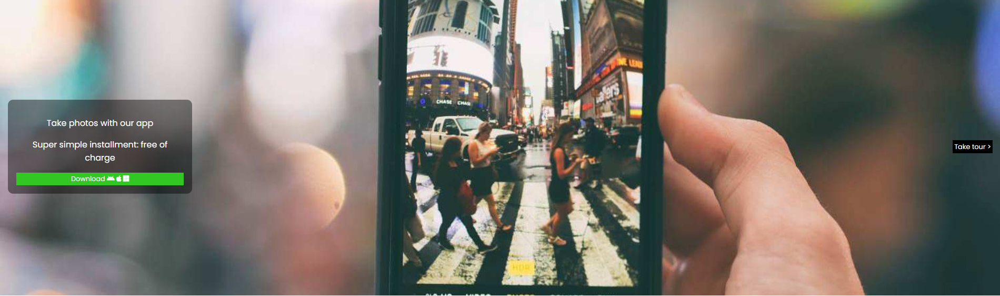

# Project Title

A brief description of what this project does and who it's for

- first item
- second item

```echo "hello world"```

## Screenshots




## Documentation

[mon app2](https://github.com/DaarikJR/app2)


## License

[MIT](https://choosealicense.com/licenses/mit/)

